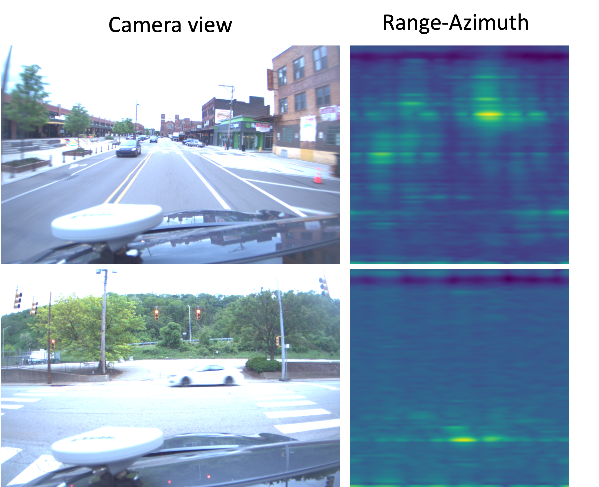

# Pitt-Radar

This is a new radar dataset that contains 50k of radar scans collected using TI AWR1843BOOST in Pittsburgh, PA, USA. The RGB images are currently removed due to the internal privacy review. Only the Radar frames are provided currently.



## News

- [Aug 2023] We release the 50k frames (radar maps only) at the [link](https://drive.google.com/drive/folders/1v2w7F-DQBNCthbl0z_h-EbTZfK8A0IgB?usp=share_link).

- [March 2023] We release the first version of 5k frames of our dataset at the [link](https://drive.google.com/drive/folders/1v2w7F-DQBNCthbl0z_h-EbTZfK8A0IgB?usp=share_link) in the resolution of 128 samples in range. Other parts of the dataset will be released later. Stay tuned.

## Dataset Details
The dataset contains the following details:

- 50k of raw radar scans in `.bin` format.
<!-- - 50k of paired RGB camera images in `.jpg` format. -->
<!-- - Other details about the dataset, such as resolution, range, and frequency. -->

## Dataset Format
The dataset is provided in <format>, and includes the following:

- A `./frames` containing raw radar scans.
<!-- - A `./images` containing paired RGB camera images. -->

## Data Collection
The radar scans and RGB camera images were collected using TI AWR1843BOOST in Pittsburgh, PA, USA. The data was collected by [DENSO](https://www.denso.com/us-ca/en/) and includes scans from several different collection runs.

## Usage
The dataset can be used for a variety of applications, including object detection and tracking, depth estimation, and scene understanding.

## Citation
If you use this dataset in your research, please cite our paper:

```
@inproceedings{li2023pittradar,
  title={Azimuth Super-Resolution for FMCW Radar in Autonomous Driving},
  author={Li, Yu-Jhe and Hunt, Shawn and Park, Jinhyung and O'Toole, Matthew and Kitani, Kris M},
  booktitle={Proceedings of the IEEE/CVF Conference on Computer Vision and Pattern Recognition},
  year={2023}
}
```

## License
This dataset is released under the MIT license. Please see the LICENSE file for more details.

## Contact
If you have any questions or feedback about the dataset, please contact us at yujheli@cs.cmu.edu.